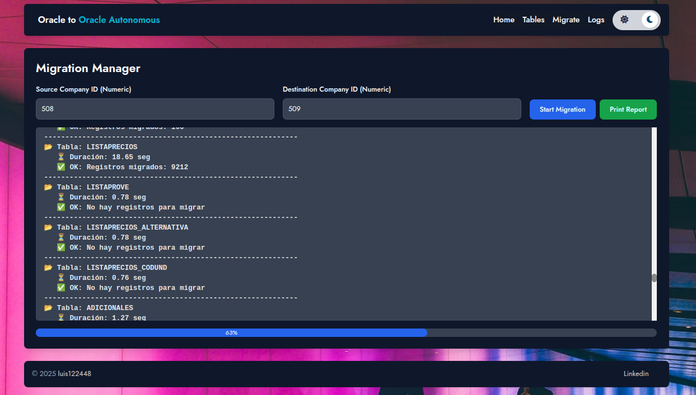

# Oracle to Oracle Autonomous Database Migration Web Application



## Overview

This project is a web application designed to facilitate the migration of data between Oracle databases, specifically targeting Oracle Autonomous Database as the destination. It provides a real-time monitoring interface for the migration process, along with basic configuration options for managing the list of tables to be migrated. Additionally, it includes a logging system for analysis and debugging.

## Features

*   **Backend API:** Handles the core migration logic from Oracle to Oracle Autonomous Database.
*   **Frontend Web Interface:** Provides a user-friendly interface for:
    *   Real-time migration progress monitoring.
    *   Configuration of tables to be migrated.
    *   Access to migration logs for analysis and debugging.

## Requirements

To run this application, you only need:

*   Docker
*   Docker Compose

## Configuration

Before running the application, you need to set up your environment variables. Create a `.env` file in the root directory of the project with the following variables, as dictated by `docker-compose.yml`:

```
DB_ORACLE_USER_TRANSACTIONAL=
DB_ORACLE_PASSWORD_TRANSACTIONAL=
DB_ORACLE_DSN_TRANSACTIONAL=
DB_ORACLE_USER_WAREHOUSE=
DB_ORACLE_PASSWORD_WAREHOUSE=
DB_ORACLE_DSN_WAREHOUSE=
```

**Customization Options:**

*   **Pre and Post Migration Scripts:** You can customize SQL scripts that run before and after the migration process. These files are located in:
    `backend/app/database/`
    *   `BEFORE_MIGRATE.sql`
    *   `AFTER_MIGRATE.sql`
*   **Tables to Migrate:** The default list of tables to be migrated can be edited in:
    `backend/app/utils/tables_backup.txt`
*   **Advanced Customization:** More advanced customizations will require direct modifications to the project's source code.

## Getting Started

1.  Ensure you have Docker and Docker Compose installed.
2.  Create and configure your `.env` file as described in the "Configuration" section.
3.  Execute the `compileDocker.sh` script from the project root:

    ```bash
    ./compileDocker.sh
    ```

    This script will build the Docker images, create the containers, and start the application in detached mode.

4.  Once the containers are running, open your web browser and navigate to:

    `http://localhost:8082`

    You will be able to access the web application's functionalities.

## License

This project is open-source software.